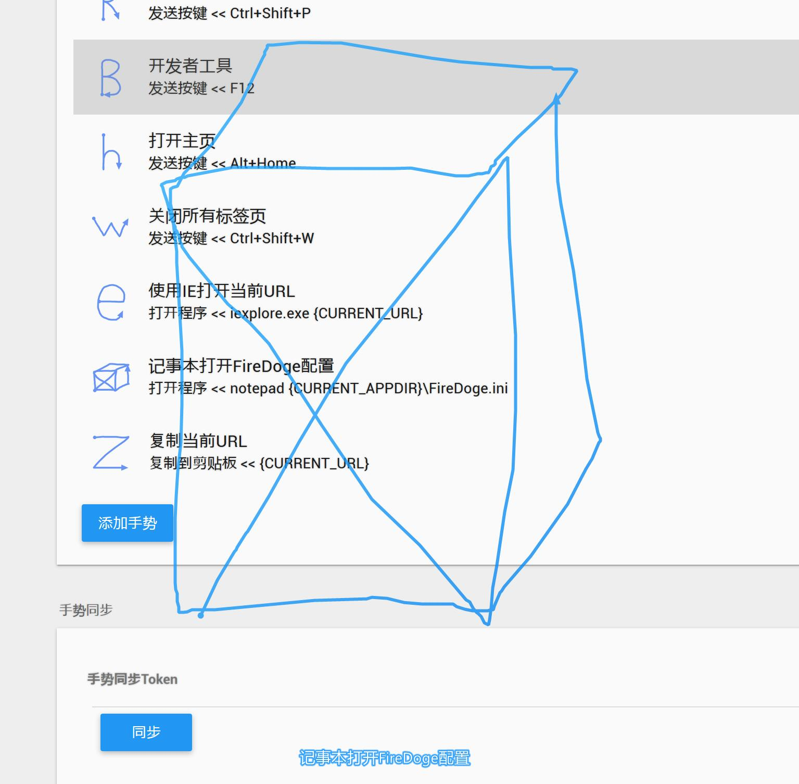

# FireDoge

[English](README.md) | [简体中文](README_ZH.md) 

A Firefox extension that make Firefox portability and gestures by dll injection

`Please consider that the current version of Firefox has disabled the dll injection, this repository is only for learning now`

## Referenced 3rd party libraries

[GreenChrome](https://gitee.com/shuax/GreenChrome) (src/gesture) Provides gesture processing logic  (**Thanks [shuax](https://github.com/shuax)**)

[minhook](https://github.com/TsudaKageyu/minhook) (3rd/minhook) Provides easy hijacking function

[cjson](https://github.com/DaveGamble/cJSON) (3rd/cjson) Provides lightweight json processing

[wtl](https://github.com/dacci/wtl) (3rd/wtl) Provide WTL function wrapping

[mini_gzip](https://github.com/shuax/mini_gzip) (3rd/mini_gzip) Provide gzip processing

[mongoose](https://github.com/cesanta/mongoose) (3rd/mongoose) Provides lightweight web request processing

[VC-LTL](https://github.com/Chuyu-Team/VC-LTL) (Shared.props)  A runtime based on Microsoft VC modifications that effectively reduces application size